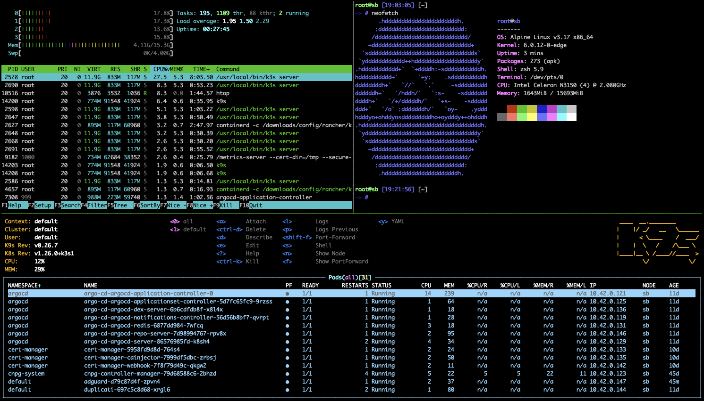

# Homelab

My Homelab! All running on an old, low power N3150!



**Pending improvements:**

- [ ] Fix automated Ansible Shell change. Today this doesn't work on Alipine. 
  - [ ] Pending [ansible/issues/61911](https://github.com/ansible/ansible/issues/61911)
- [ ] Leverage `MixedProtocolLBService`. Alpha since Kubernetes `1.20`.
  - [ ] Pending move to beta. [k8s feature gates](https://kubernetes.io/docs/reference/command-line-tools-reference/feature-gates/)
  - [ ] Pending [metallb/issues/1050](https://github.com/metallb/metallb/issues/1050)
- [ ] New hardware.
  - [ ] Needs intel quick sync video for HW transcoding.
  - [ ] NUC 8th gen i5 or better. 

## Setup

Automated via Ansible. Make sure to:
- set correct IP in `inventory`. 
- enable ssh key auth using `ssh-copy-id root@<ip>` 

To kick of the configuration:

```sh
ansible-playbook play.yml
```

## Todo

**Automation:**

- [ ] Make Plex wait for Intel Daemon set (via init container?)
- [ ] Setup TLS 
  - https://traefik.io/blog/traefik-proxy-kubernetes-101/
  - https://sysadmins.co.za/https-using-letsencrypt-and-traefik-with-k3s/

## Completed fixes for future reference

1. Ensure Traefik can connect to insecure backends for Unifi and Argo. As we terminate TLS at Traefik.
  - https://rancher.com/docs/k3s/latest/en/helm/#customizing-packaged-components-with-helmchartconfig
  - https://github.com/traefik/traefik-helm-chart/blob/master/traefik/values.yaml

```yaml 
apiVersion: helm.cattle.io/v1
kind: HelmChartConfig
metadata:
  name: traefik
  namespace: kube-system
spec:
  valuesContent: |-
    globalArguments:
    - "--serversTransport.insecureSkipVerify=true"
```

View [ServersTransport for Argo to see how it was fixed](/k8s/cluster-apps/argocd/custom.yaml)

## Notes

To deploy helm charts manually

```sh
cd <cluster-apps/name>
helm dependency build
helm install -f values.yaml <name> ./
```