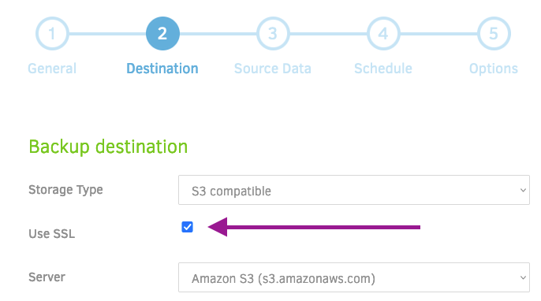

# s3 Cloudformation

Creates s3 bucket for storing homelab app configuration backups.

Bucket policy enforces SSL as per:

```yaml
Statement:
    - Action: "s3:*"
    Condition:
        Bool:
        "aws:SecureTransport": "false"
    Effect: Deny
```

Make sure SSL is enabled in Duplicati:


