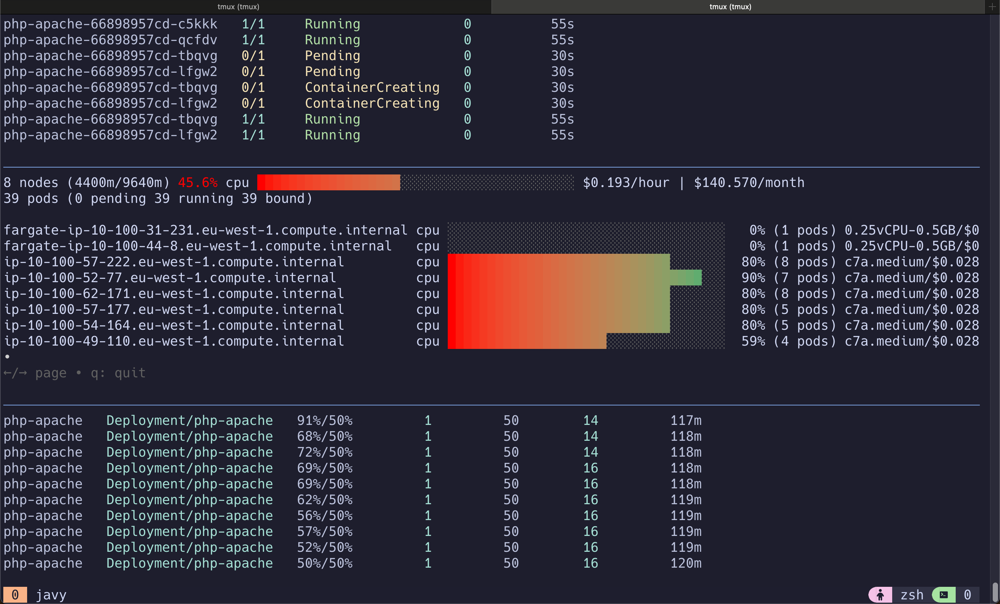

To generate load:

```sh
# Run this in a separate terminal
# so that the load generation continues and you can carry on with the rest of the steps
# kubectl run -i --tty load-generator --rm --image=busybox:1.28 --restart=Never -- /bin/sh -c "while sleep 0.01; do wget -q -O- http://php-apache; done"
kubectl run -i --tty load-gen1 --rm --image=busybox:1.28 --restart=Never -- /bin/sh -c "while true; do wget -q -O- http│://php-apache > /dev/null; done"
kubectl run -i --tty load-gen2 --rm --image=busybox:1.28 --restart=Never -- /bin/sh -c "while true; do wget -q -O- http│://php-apache > /dev/null; done"
kubectl run -i --tty load-gen3 --rm --image=busybox:1.28 --restart=Never -- /bin/sh -c "while true; do wget -q -O- http│://php-apache > /dev/null; done"
```

In another window, split tmux in 3 horizontal Windows

```sh
k get pods --watch
eks-node-viewer
k get hpa --watch
```


